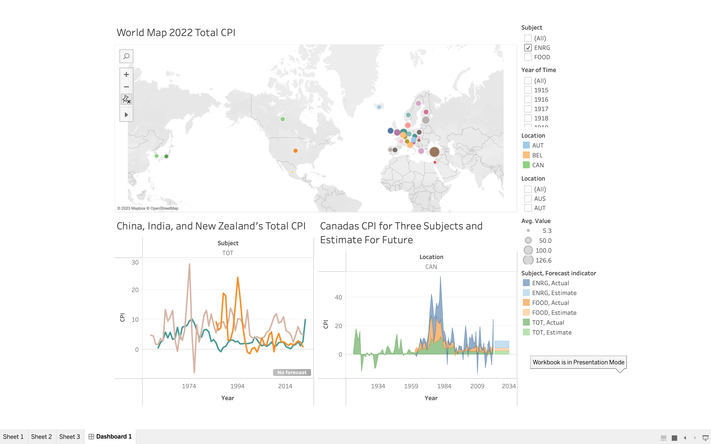

# Group 19 - How government policies changes a countries economy

- Your title can change over time.

## Milestones

Details for Milestone are available on Canvas (left sidebar, Course Project).

## Describe your topic/interest in about 150-200 words
Our group was highly interested in doing something in the area of finance due to the importance of understanding the economy for our lives and the large amount of data on the topic. From there we decided to do something within the topic of inflation because of the importance inflation and the potentially serious effects it has on our future. The data set we are working with is about CPI and breaks it down into multiple subjects. CPI stands for Consumer Price Index which is the change in price on a basket of goods of either a certain subject or an assortment of different subjects. The questions we would like to answer with our dataset include:
- How does the CPI affect a nation's stability, and if there are possible relationships between other nations?
- Effectiveness of Canadian strategies in comparison to other nations, and interest in predicting the rate for the possible future?
- How CPI changes in different subjects of the same year or if they stay similar through time?

## Describe your dataset in about 150-200 words

The dataset selected for our project is from Organisation for Economic Co-operation and Development (OECD). The dataset is produced for public consumption and is highly extensive and thoroughly built. The data itself shows the Inflation (CPI) for food, energy, and total. There is data from 46 different countries and six different organizations or combinations of countries. For the data the range of years differ from the different topics or countries. All data ends in 2022 however the earliest it starts for one of the four categories is 1914. The purpose of this dataset is to inform the public of what is happening all around the world in the economy. The wide range of data provided helps us see how much it differs from year to year and allows us to better understand what it all means. It also illustrates how difficult it can be to predict the economy due to the constant fluctuation of the world markets. By analyzing this dataset, we hope to better understand the world economy specifically the correlation between CPI and how the country runs their economy. This dataset was interesting due to inflation being such a major issue in the world we felt it was a smart idea to better understand how it truly works.

## Team Members

- Dylan Saunders: I am a data science major and I am hoping to take an internship with an accounting firm this summer in their data analytics department.
- Levi Boswell: Comp Sci major with keen interest in intelligent machines
- Zain Ali: Interested in the ramifications inflation has on the world economy and how different countries change in comparison to each other.

## Images

{You should use this area to add a screenshot of an interesting plot, or of your dashboard}

## References

OECD data - [https://data.oecd.org/price/inflation-cpi.htm]
