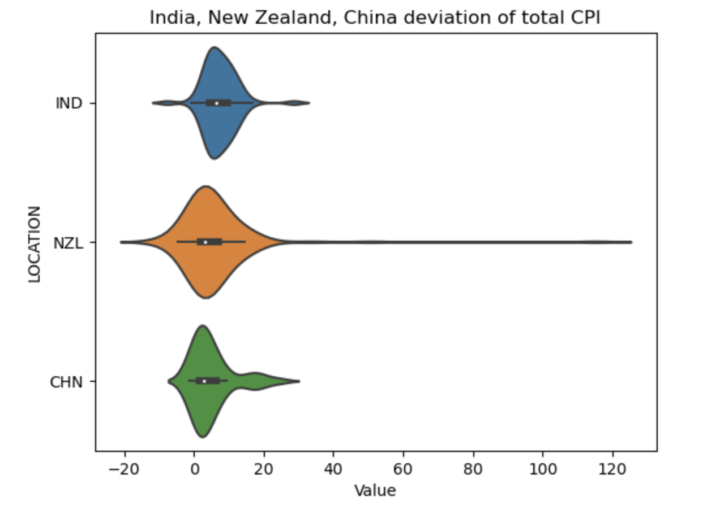
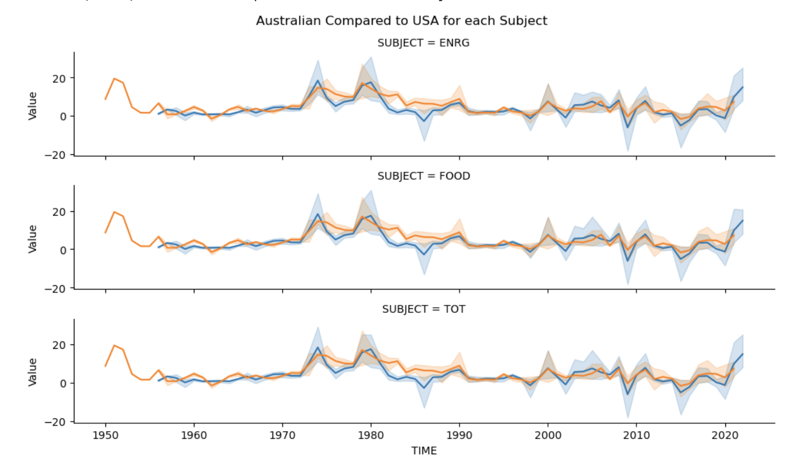

### Introduction:
Our project is focuses on inflation more specifically CPI which stands for consumer price index. CPI is the change in price on a basket of goods either for one subject or type of product or many different types of products. CPI is one of the most well-known indicators of inflation and how it has changed over time. Inflation affects every aspect of our life and needs to be understood and potentially controlled and adapted to improve the economy or else it could be the downfall of a country's economy or the world's economy. These are very extreme consequences however it is important to understand the ramifications of inflation and the importance of being aware of it. By using a large dataset with a wide range of years for 46 different countries we feel this dataset gives the best representation of all different economies. Our project of exploring this large amount of data we feel makes it easier for a person with no previous knowledge of CPI to understand what it means and how it affects us. This is why our project is important because just looking at this data there is 293 430 rows and 8 columns so without wrangling and cleaning the data it is nearly impossible to just observe it on your own and process what it means. The addition of visualizations further assists in the understanding and the comparison of different factors such as subjects or countries economies.

### Exploratory Data Analysis:

### Question 1

#### What affect does a government's economic system and practices have on the nations economic stability and consistency? 

Most countries have conflicting opinions of how to control the economy and by observing how different economies lead to a more efficient or stronger economy we can learn what economies are best over a long term rather than a single year.

The first graph is a violin plot which displays 3 different countries total CPI for all years. A violin plot is similar to a box plot which it represents the variation of all total CPI values throughout the years the wider the image the more points in that section. This means the wider the violin plot the more consistent the CPI is through all the years and the skinnier it is the more spread out points are. 
