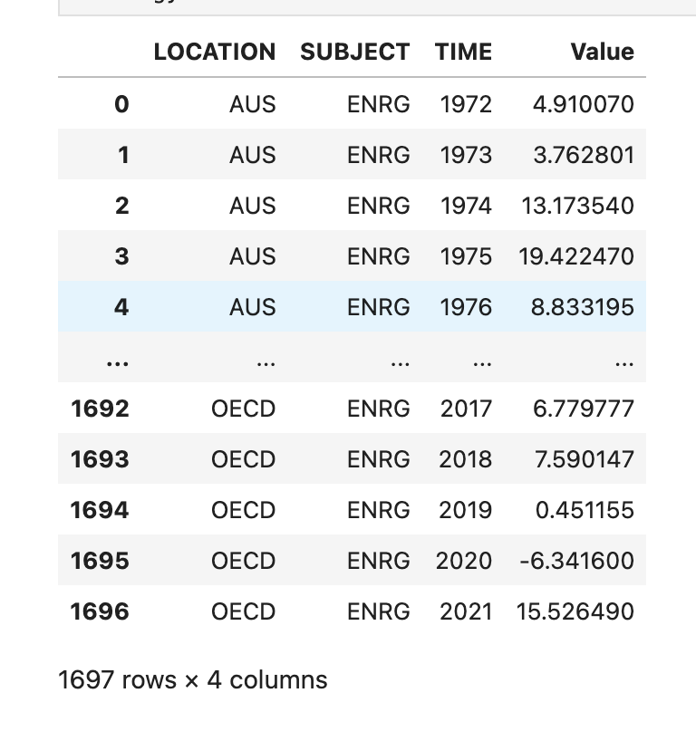
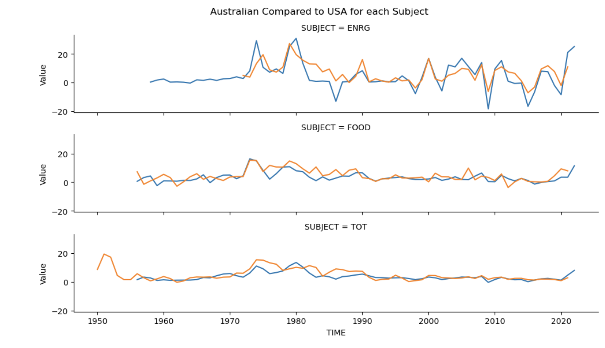
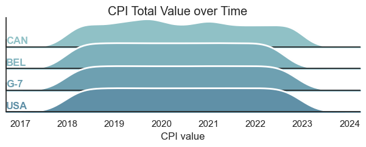
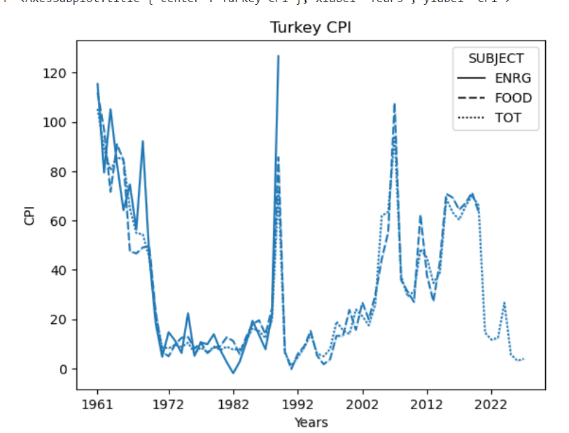
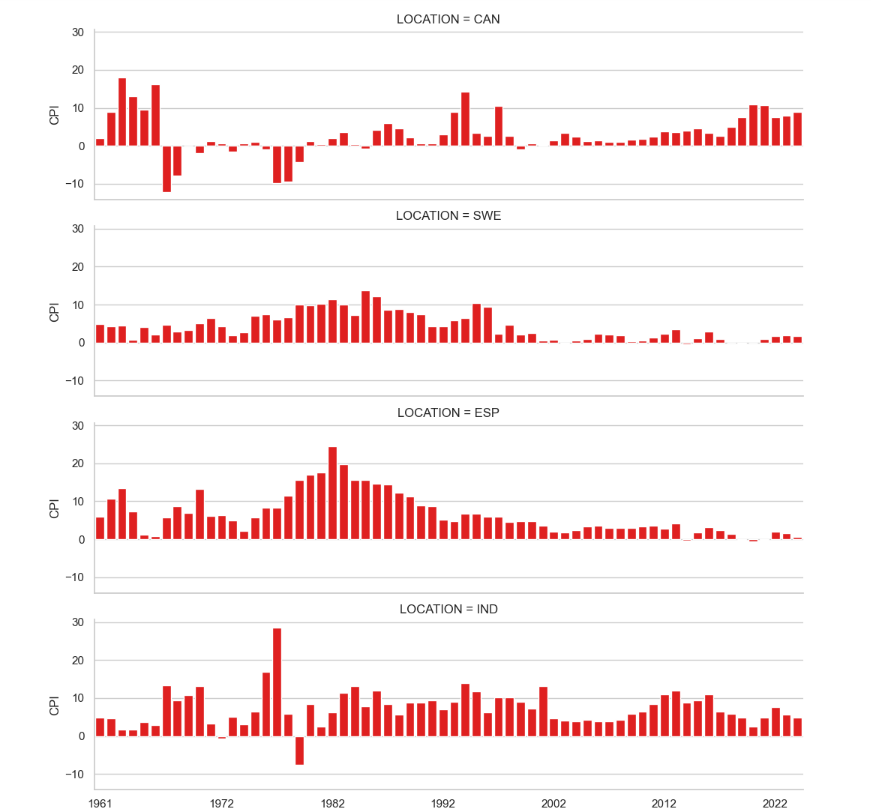
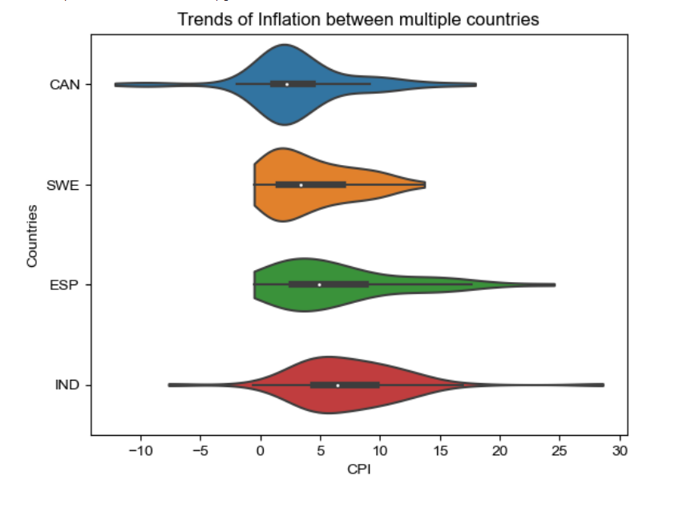

### Introduction:
Our project is focuses on inflation more specifically CPI which stands for consumer price index. CPI is the change in price on a basket of goods either for one subject or type of product or many different types of products. CPI is one of the most well-known indicators of inflation and how it has changed over time. Inflation affects every aspect of our life and needs to be understood and potentially controlled and adapted to improve the economy or else it could be the downfall of a country's economy or the world's economy. These are very extreme consequences however it is important to understand the ramifications of inflation and the importance of being aware of it. By using a large dataset with a wide range of years for 46 different countries we feel this dataset gives the best representation of all different economies. Our project of exploring this large amount of data we feel makes it easier for a person with no previous knowledge of CPI to understand what it means and how it affects us. This is why our project is important because just looking at this data there is 293 430 rows and 8 columns so without wrangling and cleaning the data it is nearly impossible to just observe it on your own and process what it means. The addition of visualizations further assists in the understanding and the comparison of different factors such as subjects or countries economies.

### Exploratory Data Analysis:
This is a large data set about CPI from the OECD(The Organization for Economic Cooperation and Development) website. [The full dataset can be viewed on their website here.](https://data.oecd.org/price/inflation-cpi.htm) There is 47 countries and 6 organizations CPI for multiple subjects or types of products such as food, energy, total, and total less food, and less energy. There is 293 430 rows and 8 columns. The first column is location which has a 3 or 4 letter that stands for the country or organization. This is very important when grouping data together or splitting it up to compare locations and different economic systems. The second column is indicator which states that all of the values are about CPI and for each row the indicator is CPI. This means that this column is not important and can be dropped during the data cleaning process. The third column is subject which indicates that the CPI value is for energy, food, total, or total less food, and less energy. This column is also very useful to group by and split data to compare how different subjects change throughout time. The fourth column is measure which is what organization collected the data that is used in this dataset. This column can be dropped because it is not useful in the dataset since we do not care how the data is collected merely what value is recorded. The fifth column is frequency it contains one letter that changes periodically however it is not useful for our data and can be dropped when cleaning the data. The sixth column is time which is split up by years, quarters, or months throughout the data set. The earliest year is 1921 and the latest is 2022 depending on the country and how much data was available at the time. This column is very useful and we can decide what data to use depending on what we are trying to show. The seventh column is Value which is the CPI value for each row. The eighth column is Flag Codes which has very few values and the rest are nAn. This means that this column is not important for our purposes and can be dropped during data clean. 

By grouping by the energy subject it is easier to breakdown the data into smaller section to investigate it further. 

### Question 1

#### What affect does a government's economic system and practices have on the nations economic stability and consistency?

Most countries have conflicting opinions of how to control the economy and by observing how different economies lead to a more efficient or stronger economy we can learn what economies are best over a long term rather than a single year.

The first graph is a violin plot which displays 3 different countries total CPI for all years. India has a more socialist economy, New Zealand is a more capitalist economy, and China is a more communist economy. These different economies all spend money on different things on focus on different ideas to help the economy grow and the inflation rate stay consistent year after year. A violin plot is similar to a box plot which it represents the variation of all total CPI values throughout the years the wider the image the more points in that section. This means the wider the violin plot the more consistent the CPI is through all the years and the skinnier it is the more spread out points are. This illustrates that all 3 countries are somewhat consistent and similar even with the different economic styles. New Zealand has extremely low and extremely high values, however there is a large amount of similar values. China and India don't have the same extreme values and China has a higher number of high values compared to India. 

The second graph is a facet grid of 3 line plots hued by the 3 different subjects. CPI of food, energy, and total. There are also 2 lines one for Australia and one for United States of America. These 2 countries both have a mixed economy meaning by comparing these countries of similar economies in contrast with the last graph of different economies we can see if the trends are similar among all economies or if all of the countries are different even if they have the same economic structure. This would imply that economic structure does not play a large role in the change in CPI which in turn means the inflation for the country. The reason for choosing USA and Australia as well as their similar economies is that they are not near each other and their potential similarities can not be written off as a reliance of each others economies. The graph displays that for all 3 subjects the lines are very similar to each other even more similar than the violin plot of different economic systems. This indicates that different economic systems plays some part in CPI, however that is not the only factor at play in influencing the inflation rate. 

### QUESTION 2

### What patterns in the CPI lead to show whether Canada is weakeneing or stenghting its economy over the past 5 years?

In order to extrapolate on the subject, it can be difficult to see at first glance at the graph, whether CPI does anything meaningful on a large scale.  We can feel the change in our wallets, year after year, and particularly when it's above a certain percentile I feel it even more so. Taking a look at the Rdigline plot below, it can be hard to tell whether any particular country or groups of countries are doing better than one other with such a broad stroke.  The width of the graph shows the total CPI spread over the course of 5 years and there is not much difference in the widths.

To break things down further, a second graph is created still taking from the range but with an accumulated sum of values 'CPI'.  The thicker the width, the more CPI values populate that range.  We can see that Cananda has quite a thick tail around 0-2 suggesting that Canadian inflation rates over the five years stay fairly consistent in comparison to our other democratic nations.  I do include G-7 countries, in particular, to show that even though USA and CAD are included, it can give a nice base line estimation.  I chose Belgum as an outlier country comparison because of some their similarities to Canada.  The USA is most like Canada and is a good comparison for Canada due to our similarities in size, our connections for commerce and trade, etc.

The most detailed graph, however, shows the trends much more clearly. This line graph show actual CPI values over the course of the designated time period.  There are three graphs; Food and Energy titled 'FOOD','ENRG' respectively and 'TOT' for total, combined.

Canada has a low overall score, which is something I expected from our violin plot, but we can see that Canada's policies also seemed to impact the wider world as seen near the end of 2022 as Canada had a sharp spike and so did the G-7.  This could mean that Canada plays a larger role for its relative size as a strong economic power because it would not otherwise had had such an effect especially when the USA is also in a steady decline with a small plateau, but still declining. While comparing Canada to Belgum, we can see that the green line representing Belgium shows their trajectory rose higher and more sharply than all others before it started to decline.  

There could also be other factors at play such as Canada and the USA being very close trade partners and what happens in the US is often mirrored in Canada.  But in terms of Canada's policies, it seems Canada could be playing a leading role due to the data shown. Canada is so consistent in its policy and shows stability that this could indicate a strong economic prosperity or resilience. Because  Canada's  Bank of Canada economic policies is separate from politics, the CPI can make a good estimation of how well our economy is performing over an extended period of time.

### Question 3
####  Does a high CPI indicate whether an economy is developing or developed, and what are the trends between developing and developed countries of similar economic models?

We can initially perform an analysis to see whether the trends in the different forms of CPI of a country are related to one another. 

We can see that Food prices and energy prices are both related to each other and have relatively similar trends. This means the total CPI of both together is good to use for a general long term CPI comparison across countries. Next is to see the trends of CPI of a developing country, next to a developed country. Choosing China, India, Sweden, and Canada as all have a similar econmic model post 2002. 

We can see that the system works similarly for India, Spain, and Canada. We can see that the trends in CPI for these countries being fairly mixed economies are similar, however, there is a major differrence in CPI level, as we see that both of our developing countries Spain and India have significantly higher CPI levels, up untill 2020 due to the effect of the Covid pandemic. There is a slight exemption from EU nations,such as Sweden, as while they have similar trends to one another, the trends slightly differ from other countries. This could be due to the identical union rules that these countries follow. One Identical trend between all countries is the sharp increase in CPI following the Covid pandemic.

All plots in the violing graph show us that average CPI level for all of these countries, Is not too far off. All plots show a similar shape, showing that inflation trends are relatively similar for each of these plots.The 2 developing countries observe the highest CPI levels, higher than the 2 developed countries by a significant margin. This allows us to conclude that post year 2000, countries with similar economic policies enjoy similar trends, regardless of their development rate, however, developing countries tend to have a higher CPI level for the most part.

### Conclusion:
This dataset concerning CPI in different countries was so extensive that each member of the group was able to answer different questions with the data provided. This allowed us to maximize the potential of our dataset and pull the most information out of it that we can then express to those observing and viewing our visualizations. By answering these different questions we were also able to convey how essential CPI is to everyone and how much it affects on both a day to day basis and in the long term. These factors shape the society around us and as displayed every country is affected differently and when you approach from a different angle there is more to learn about what is the best way to handle or control CPI. 

